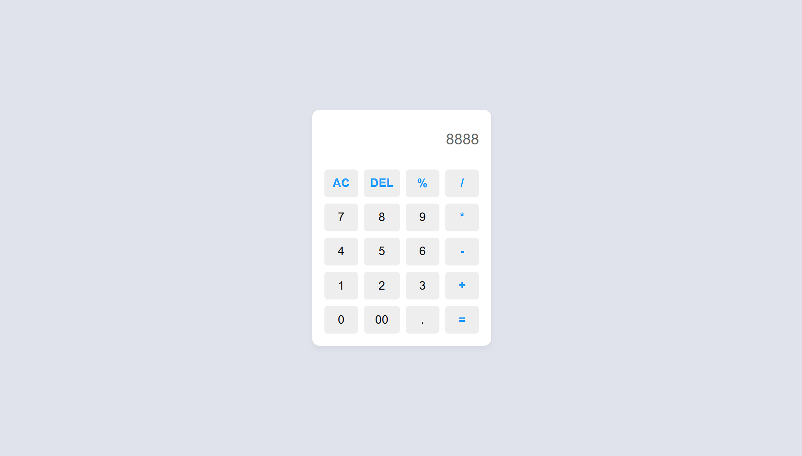
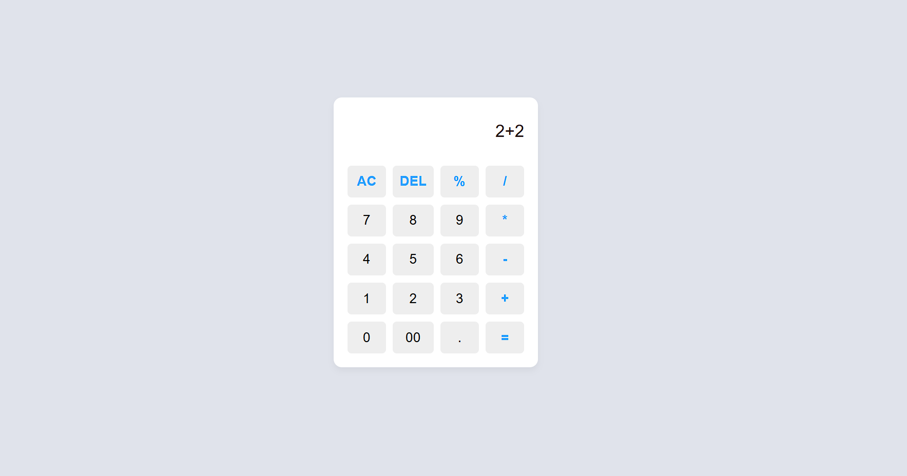

## 🧮 Calculator App
A responsive and user-friendly Calculator built using HTML, CSS, and JavaScript. This web-based app performs basic arithmetic operations and is perfect for learning DOM manipulation and event handling.

## ✨ Features
✅ Addition, Subtraction, Multiplication, Division etc

✅ Clear and Delete functions

✅ Responsive layout (works on mobile and desktop)

## 🛠️ Tech Stack

HTML – Markup structure

CSS – Styling and layout

JavaScript – Functionality and logic

## 📸 Screenshots

## Image 1

## Image 2

## Image 3

