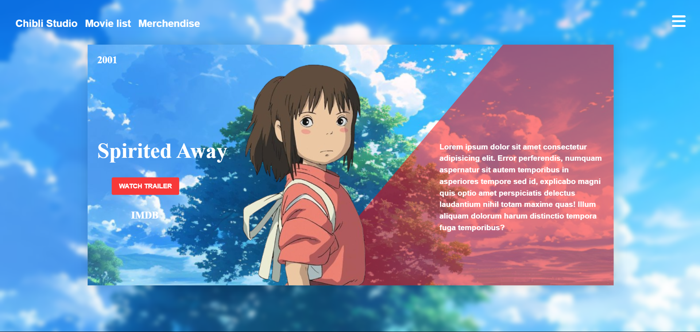

## Anime Card UI – Spirited Away Tribute
I saw a web-reference in pinterest and created a visually striking anime card component designed from scratch using HTML and CSS. This project pays tribute to Studio Ghibli's legendary film Spirited Away, featuring a custom layout, stylish navigation, and subtle animations.

## Features
-Responsive and styled navigation bar

-Anime-themed card layout with image and year info

-Interactive Watch Trailer button with heartbeat animation

-Descriptive right-info section mimicking a short movie summary

-Fully responsive and centered card using flex and transform

-Background blur and image overlays for modern aesthetic

## Tech Stack
-HTML5
-CSS3
-Font Awesome (for icons)

(Add this image once you take a screenshot)

## Image

## Acknowledgement
Inspired by Studio Ghibli's art and storytelling.